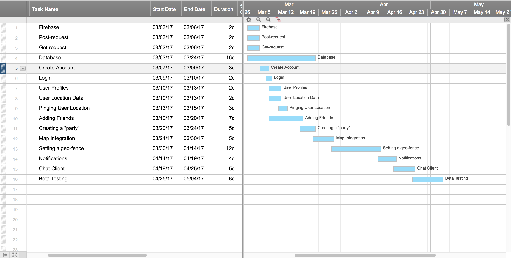

# 4.0 Software Development Plan

## 4.1 Plan Introduction
SafeNet is an application that aims to ease the stress of traveling with the freedom of personalized exploration. Within the application users can create "parties" with a group of users on their friends list. The user that created the party will be the party leader and can create a geo-fence, called a "SafeNet", of their preference. This application will then keep track on all party members within the geo-fence and will notify the party leader when a member has left the "SafeNet". This application will target and try to best aid teachers in tracking their students during field trips and other such outings.

Within the scope of using Firebase, I should accomplish the following tasks by the designated deadlines:
-   Post-request (03/05)
-   Get-request (03/05)
-   Login/Sign-up (03/05)
-   User Profiles (03/10)
-   User location data (03/20)
-   Pinging location data (03/28)
-   Adding friends (04/10)
-   Creating a "party" (04/10)

Creating the user interface should be accomplished by the following deadlines:
-   Map integration (03/15)
-   Setting a geo-fence (04/15)
-   Notifications (04/15)
-   Chat client (04/20)

Testing the product should be accomplished by the following date:
-   Beta Testing (04/25)
-   MVP User Interface (05/04)

### 4.1.1 Project Deliverables
The following items are to be delivered to the customer:
-   Requirements Document (02/05)
  - This document will detail the low-level requirements of our project.
-   Written Status Reports (02/20)
  - This document will report our current status and health of our project
-   Software Development Plan (02/27)
  - This document will define the process and resources that will be used during the semester to produce all the required documents and software.
-   Software Development Plan (Re-submit) (03/20)
  - This document will define the process and resources that will be used during the semester to produce all the required documents and software.
-   Written Status Reports (03/20)
  - This document will report our current status and health of our project
-   Requirements Document (Re-submit) (04/03)
  - This document will detail the low-level requirements of our project.
-   Written Status Reports (04/03)
  - This document will report our current status and health of our project
-   Written Status Reports (04/17)
  - This document will report our current status and health of our project
-   Final Project Presentation (05/04)
  - This presentation will outline the final product and the process it took to make it.

## 4.2 Project Resources

### 4.2.1 Hardware Resources

| Operating System | CPU Name      | CPU speed | # of CPU Cores | Amount of Ram | Name of GPU             | Amount of VRAM | Purpose     |
|:----------------:|---------------|-----------|----------------|---------------|-------------------------|----------------|-------------|
| OSX              | Intel Core i5 | 2.5 GHz   | 4 Cores        | 8 GB          | Intel HD Graphics 4000  | 1536 MB        | Development |

| Operating System | Model     | Purpose |
|:----------------:|-----------|---------|
| iOS              | iPhone 6  | Testing |

### 4.2.2 Software Resources

| Team    | Software Used                                                                        | 
|---------|--------------------------------------------------------------------------------------|  
| iOS     | CocoaPods, Firebase, Xcode                                      |   

-  CocaoPods
  - This will help manage all of the dependencies I plan to use
-  Firebase
  - This resource will help me store data in a sever
-  Xcode
  - This will be the IDE when developing this app

## 4.3 Project Organization
Since this is my own project with only me as the team, there is no team organization. However, I will work on the project in the order of setting up the database, creating the front-end, and then adding functionality. I will be working on my own but also will give weekly updates during class on my progress and the difficulties I encounter. 

## 4.4 Project Schedule
The have a list of features that must completed for a minimum viable product which are detailed in the GANTT Chart. All development is done on iOS and is detailed in the hardware resources.

### 4.4.1 PERT/GANTT Chart

To view the GANTT chart on a web browser, click [here](https://app.smartsheet.com/b/publish?EQBCT=f9a49dbaf2f54ec5b97f81058c231e16)

### 4.4.2 Task/Resource Table
Since I am the only member developing this project, I am in charge of developing everything.
